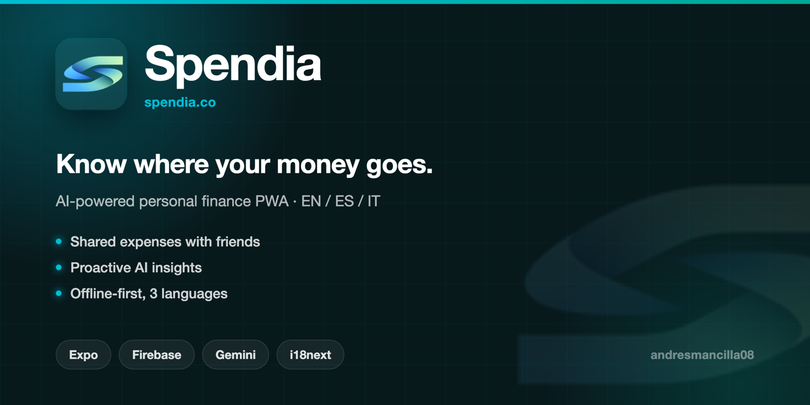

<p align="center">
  
</p>

# Spendia

**Personal finance that explains itself.** Track spending, split expenses with friends, and get your month summarized in one sentence — no spreadsheets, no manual categorizing.

🌐 **[spendia.vercel.app](https://spendia.vercel.app)** · Installable PWA · EN / ES / IT

---

## Features

**Money in, money out**
- Transactions with automatic categorization — local keyword matching first, AI only when that fails
- Receipt OCR: photograph a receipt, get the transaction pre-filled
- Recurring transactions, budgets per category, savings goals
- Multi-currency with live exchange rates (Banco de la República TRM, ECB, with fallbacks)

**Shared expenses**
- Expense groups with friends, per-person balances and settle-up
- Payment QR to get paid back
- Friend reports

**Insight**
- "Your month in one sentence" — an AI insight computed from aggregates only, never personal data
- Reports, category breakdowns and trends
- Premium visual layer (Pro Visuals) on top of the free experience, which stays untouched

**Platform**
- Installable PWA with offline-tolerant Firestore sync
- Biometric lock, secure storage
- Full personalization: 10 animated backgrounds, themes, speed control
- Trilingual (EN / ES / IT), no hardcoded strings

## Stack

| Layer | Tech |
|---|---|
| App | Expo SDK 55 · Expo Router · React Native (web target) |
| State | Zustand |
| Data & auth | Firebase (Auth, Firestore, Storage, Rules) |
| AI | Gemini 2.0 Flash, server-side only (Vercel Functions) |
| i18n | i18next / react-i18next |
| UI | Tabler Icons · react-native-svg · Expo Blur / Linear Gradient / Haptics |
| Hosting | Vercel |

## Architecture notes

- **AI keys never reach the client.** `api/categorize`, `api/insight` and `api/ocr` are Vercel Functions holding the Gemini key server-side. The client always has a local fallback (keyword categorization, template sentence) so the app works if AI is unavailable.
- **Receipt images are not persisted** — processed in the request and discarded.
- **Insights receive aggregates, not records** — numeric totals and category labels, never transaction descriptions or personal data.
- **Exchange rates cascade through three sources** with CDN caching (`s-maxage=900`), so a dead upstream never breaks the app.

## Running locally

```bash
yarn install
cp .env.example .env        # Firebase config + Gemini key for the API routes
yarn start                  # Expo dev server
yarn export                 # production web build
```

## Structure

```
app/            Expo Router routes — (auth), (onboarding), (tabs) + detail screens
api/            Vercel Functions: categorize · insight · ocr · exchange-rates
components/     UI components
store/          Zustand stores
locales/        en.json · es.json · it.json
functions/      Firebase Cloud Functions
firestore.rules Security rules
```
